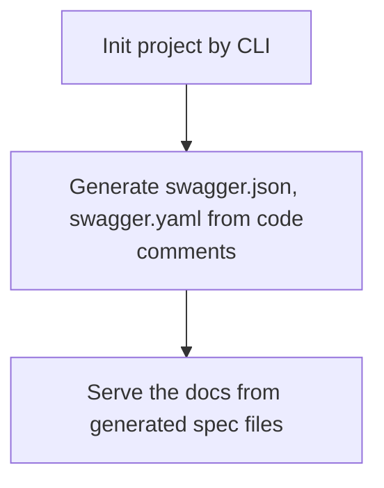

# Tonic

Tonic is a simple & lightweight library for create swagger documentation for your APIs. It's compatible with all Go web frameworks like Gin, Echo, Fiber, etc.

> For the first release, Tonic may not support all features of OpenAPI and has some limitations. Welcome all contributions to make Tonic better.

## Why's Tonic?

[Swag](https://github.com/swaggo/swag) and its peer packages are great, but they are too complex and not fully automatic.

Usage flow of [swaggo](https://github.com/swaggo) combo:



Meanwhile, Tonic just reflects the code and generates the swagger documentation directly from the code itself.

## Examples

### Gin

```go
package main

import (
    "github.com/gin-gonic/gin"
    "github.com/TickLabVN/tonic"
)

type PingResponse struct {
    Message string `json:"message"`
}

func Ping(c *gin.Context) {
    response := PingResponse{
        Message: "pong",
    }
    c.JSON(200, response)
}

func main() {
    r := gin.Default()

    tonic.Init(&tonic.Config{
		OpenAPIVersion: "3.0.0",
		Info: map[string]interface{}{
			"title":       "Go CRUD Example",
			"description": "A simple CRUD example using Go and PostgreSQL",
			"version":     "1.0.0",
		},
	})

    rg := r.Group("/api")
    {
        tonic.CreateRoutes(rg.BasePath(), &tonic.Route{
            {
                Method: Tonic.Get,
                Url: "/ping",
                HandlerRegister: func() {
                    rg.GET("/ping", Ping)
                },
                Schema: &tonic.RouteSchema{
                    Response: map[int]interface{}{
                        200: PingResponse{},
                    }
                },
            }
        })
    }

    // tonic.GetHandler() returns the net/http handler for serving the swagger documentation
    app.GET("/docs/*w", gin.WrapH(http.StripPrefix("/docs", tonic.GetHandler())))

    r.Run()
}
```
