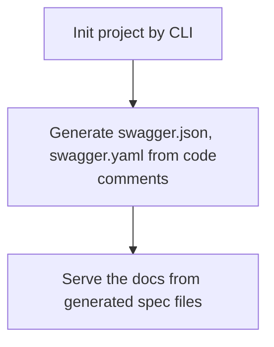

# Tonic

> See OpenAPI spec at [OpenAPI 3.0](https://spec.openapis.org/oas/latest.html)

Tonic is an OpenAPI doc generator for Go frameworks. Unlike tools like [Swaggo](https://github.com/swaggo/swag) that rely on code comments, Tonic uses reflection to pull docs straight from your routes and struct binding tags — both request and response. Currently it works with the Echo framework.


## Why's Tonic?

In the Go world, people often go with the Design-First approach (i'm not sure why). Swaggo applies this approach, but it doesn't always work. In reality, things change. I started with a clean API spec, but once business needs shift, that spec becomes outdated fast. I got tired of updating comments every time an endpoint changed, so tedious and error-prone tasks.

Following the Code-First approach, your docs evolve with your code. So I bring Tonic to save time and keep things in sync with the actual code.

Usage flow of [swaggo](https://github.com/swaggo) combo:



Meanwhile, Tonic just reflects the code and generates the swagger documentation directly from the code itself.

## Ideas

Using `reflect`, Tonic reads struct's metadata like JSON tag, data type ... and generate an object schema for the struct. For example:

```go
type ArticleDTO struct {
    ID 		    int 	`json:"id"`
    Title 	    string	`json:"title" binding:"required,min=4,max=255"`
    Content 	string	`json:"content" binding:"required,min=20"`
}

// Will be generated to
{
    "id: {
	    "type": "integer"
    },
    "title": {
        "type: "string",
        "minLength": 4,
        "maxLength": 255
    },
    "content": {
        "type: "string",
        "minLength": 20
    }
}
```

Combine with route definitions, Tonic constructs an object to contain API documentation data in runtime, then host a swagger UI using other library.

## Example (Echo)

```go
package main

import (
	"net/http"

	"echo_example/middlewares"
	"echo_example/utils"

	echoAdapter "github.com/TickLabVN/tonic/adapters/echo"
	"github.com/TickLabVN/tonic/core/docs"
	"github.com/go-playground/validator/v10"
	"github.com/labstack/echo/v4"
)

type GetUserRequest struct {
	ID     string `param:"id" validate:"required"`
	Name   string `query:"name"`
	ApiKey string `header:"x-api-key" validate:"required"`
}

type User struct {
	ID    string `json:"id" validate:"required"`
	Name  string `json:"name" validate:"required"`
	Email string `json:"email" validate:"required,email"`
}

func GetUser(c echo.Context) error {
	data := c.Get("data").(GetUserRequest)
	return c.JSON(http.StatusOK, User{
		ID:    data.ID,
		Name:  "John Doe",
		Email: "john.doe@example.com",
	})
}

func main() {
	e := echo.New()
	e.Validator = &utils.CustomValidator{Validator: validator.New()}

	openapi := &docs.OpenApi{
		OpenAPI: "3.0.1",
		Info: docs.InfoObject{
			Version: "1.0.0",
			Title:   "Echo Example API",
		},
	}

	echoAdapter.AddRoute[GetUserRequest, User](
		openapi,
		e.GET("/users/:id", GetUser, middlewares.Bind[GetUserRequest]),
	)
	echoAdapter.UIHandle(e, openapi, "/docs")

	e.Logger.Fatal(e.Start(":1323"))
}
```